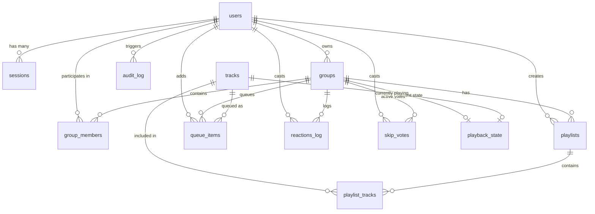

# SyncWave Architecture Specification

This document details the system design, components, database schema, real-time event protocol, synchronization mathematics, authentication lifecycle, and threat model of **SyncWave**.

---

## 1. System Component Overview

SyncWave is designed as a modular monolith optimized for zero-dependency self-hosting, instant real-time synchronization, and high performance.

```
+─────────────────────────────────────────────────────────────────────────+
|                               Browser Client                            |
|                                                                         |
|  +─────────────────────────+     +───────────────────────────────────+  |
|  |       React 18 SPA      |     |           Audio Engine            |  |
|  | - TailwindCSS & Motion  |     | - Reused HTMLAudioElement         |  |
|  | - Zustand State Stores  |<--->| - Drift Detector (NTP Offset)     |  |
|  | - BottomNav & RoomPage  |     | - Media Session API (Lockscreen)  |  |
|  +───────────▲─────────────+     +─────────────────▲─────────────────+  |
+──────────────┼─────────────────────────────────────┼────────────────────+
               | HTTP / REST (Cookies)               | WebSocket Frames
               |                                     | (Socket.IO v4)
+──────────────▼─────────────────────────────────────▼────────────────────+
|                           SyncWave Server (Node.js)                     |
|                                                                         |
|  +─────────────────────────+     +───────────────────────────────────+  |
|  |       Express API       |     |          Realtime Engine          |  |
|  | - Helmet CSP & CORS     |     | - Socket.IO v4 + State Recovery   |  |
|  | - Session Middleware    |     | - Group-Locked Mutex Queue        |  |
|  | - Zod Input Validation  |     | - Skip Vote & Presence Tracker    |  |
|  | - Auth / Admin / Music  |     | - Track Timer Expiry Engine       |  |
|  +───────────▲─────────────+     +─────────────────▲─────────────────+  |
|              |                                     |                    |
|  +───────────▼─────────────────────────────────────▼─────────────────+  |
|  |                   SQLite Engine (better-sqlite3)                  |  |
|  |  - In-process native binding (WAL Mode, synchronous=NORMAL)       |  |
|  |  - Automated Nightly Snapshots (VACUUM INTO)                      |  |
|  +───────────────────────────────────────────────────────────────────+  |
+──────────────────────────────────▲──────────────────────────────────────+
                                   | Audio Stream Direct Playback
+──────────────────────────────────▼──────────────────────────────────────+
|                       External Music Providers                          |
|  - Audius Discovery Gateways (REST metadata + 302 audio stream)         |
|  - Jamendo API (REST metadata + CC MP3 audio stream)                    |
+─────────────────────────────────────────────────────────────────────────+
```

---

## 2. Data Model & Database Schema

SyncWave stores all persistent application data in an embedded SQLite database (`data/syncwave.db`).

### Entity Relationship Diagram (ERD)



### Table Specifications

#### 1. `users`
Stores user identities, credentials, authorization roles, and avatar configurations.
```sql
CREATE TABLE users (
  id TEXT PRIMARY KEY,
  email TEXT UNIQUE NOT NULL,
  password_hash TEXT,
  google_id TEXT UNIQUE,
  display_name TEXT NOT NULL,
  avatar_emoji TEXT NOT NULL DEFAULT '🎵',
  avatar_color TEXT NOT NULL DEFAULT '#6366f1',
  role TEXT NOT NULL DEFAULT 'user' CHECK(role IN ('user', 'superadmin')),
  is_banned INTEGER NOT NULL DEFAULT 0,
  recovery_code_hash TEXT,
  force_password_change INTEGER NOT NULL DEFAULT 0,
  created_at TEXT NOT NULL DEFAULT (datetime('now')),
  last_seen_at TEXT NOT NULL DEFAULT (datetime('now'))
);
```

#### 2. `sessions`
Stores server-side session records tied to signed cookies.
```sql
CREATE TABLE sessions (
  id TEXT PRIMARY KEY,
  user_id TEXT NOT NULL REFERENCES users(id) ON DELETE CASCADE,
  expires_at TEXT NOT NULL,
  user_agent_hash TEXT,
  created_at TEXT NOT NULL DEFAULT (datetime('now'))
);
CREATE INDEX idx_sessions_user ON sessions(user_id);
CREATE INDEX idx_sessions_expires ON sessions(expires_at);
```

#### 3. `groups`
Stores persistent listening rooms and governance rules.
```sql
CREATE TABLE groups (
  id TEXT PRIMARY KEY,
  name TEXT NOT NULL,
  owner_id TEXT NOT NULL REFERENCES users(id),
  invite_code TEXT UNIQUE NOT NULL,
  invite_expires_at TEXT,
  invite_revoked INTEGER NOT NULL DEFAULT 0,
  members_can_control INTEGER NOT NULL DEFAULT 0,
  max_members INTEGER NOT NULL DEFAULT 50,
  is_closed INTEGER NOT NULL DEFAULT 0,
  created_at TEXT NOT NULL DEFAULT (datetime('now'))
);
CREATE INDEX idx_groups_invite ON groups(invite_code);
CREATE INDEX idx_groups_owner ON groups(owner_id);
```

#### 4. `group_members`
Junction table tracking room memberships and member roles.
```sql
CREATE TABLE group_members (
  group_id TEXT NOT NULL REFERENCES groups(id) ON DELETE CASCADE,
  user_id TEXT NOT NULL REFERENCES users(id) ON DELETE CASCADE,
  role TEXT NOT NULL DEFAULT 'member' CHECK(role IN ('owner', 'admin', 'member')),
  joined_at TEXT NOT NULL DEFAULT (datetime('now')),
  PRIMARY KEY (group_id, user_id)
);
CREATE INDEX idx_group_members_user ON group_members(user_id);
```

#### 5. `tracks`
Local cache of track metadata fetched from external providers.
```sql
CREATE TABLE tracks (
  id TEXT PRIMARY KEY,
  provider TEXT NOT NULL,
  provider_track_id TEXT NOT NULL,
  title TEXT NOT NULL,
  artist TEXT NOT NULL,
  album TEXT,
  artwork_url TEXT,
  duration_ms INTEGER NOT NULL,
  stream_url_cached TEXT,
  license TEXT,
  attribution TEXT,
  cached_at TEXT NOT NULL DEFAULT (datetime('now')),
  UNIQUE(provider, provider_track_id)
);
```

#### 6. `queue_items`
Ordered playback queue for a room.
```sql
CREATE TABLE queue_items (
  id TEXT PRIMARY KEY,
  group_id TEXT NOT NULL REFERENCES groups(id) ON DELETE CASCADE,
  track_id TEXT NOT NULL REFERENCES tracks(id),
  position INTEGER NOT NULL,
  added_by TEXT NOT NULL REFERENCES users(id),
  added_at TEXT NOT NULL DEFAULT (datetime('now'))
);
CREATE INDEX idx_queue_group ON queue_items(group_id, position);
```

#### 7. `playback_state`
Real-time playback state snapshot for each active room.
```sql
CREATE TABLE playback_state (
  group_id TEXT PRIMARY KEY REFERENCES groups(id) ON DELETE CASCADE,
  track_id TEXT REFERENCES tracks(id),
  is_playing INTEGER NOT NULL DEFAULT 0,
  position_ms INTEGER NOT NULL DEFAULT 0,
  updated_at_server_ms INTEGER NOT NULL DEFAULT 0,
  version INTEGER NOT NULL DEFAULT 0,
  controlled_by TEXT REFERENCES users(id)
);
```

#### 8. Supporting Tables
- `playlists` & `playlist_tracks`: Group-scoped track collections.
- `skip_votes`: Ephemeral votes to skip current track (`PRIMARY KEY (group_id, track_id, user_id)`).
- `reactions_log`: Short-retention emoji activity log.
- `audit_log`: Security and administrative action logs.
- `reports`: User moderation reports.
- `feature_flags`: Runtime configuration switches.
- `blocked_tracks`: Content takedown/moderation blocklist.
- `_migrations`: Version tracking for executed database migration scripts.

---

## 3. Realtime Event Catalog

All real-time communication occurs over Socket.IO v4, secured by session cookie validation and per-socket rate limiting.

### Client-to-Server Events (`ClientToServerEvents`)

| Event Name | Payload | Acknowledgement Callback | Description |
| :--- | :--- | :--- | :--- |
| `room:join` | `{ groupId: string }` | `(res: RoomJoinResponse) => void` | Joins a room, registers presence, and receives initial full `RoomState`. |
| `room:leave` | `{ groupId: string }` | None | Leaves a room, updates presence, and leaves socket channel. |
| `sync:ping` | `{ t0: number }` | `(res: { t0: number, ts: number }) => void` | NTP-style clock synchronization ping to calculate network RTT and clock offset. |
| `playback:play` | `{ groupId: string }` | None | Starts or resumes playback for the room. |
| `playback:pause` | `{ groupId: string, forEveryone: boolean }` | None | Pauses playback for all users (or marks caller locally paused). |
| `playback:seek` | `{ groupId: string, positionMs: number }` | None | Jumps playback position across the room. |
| `playback:skip` | `{ groupId: string }` | None | Skips current track and loads next track from queue. |
| `playback:ended`| `{ groupId: string, trackId: string, version: number }` | None | Signals that the audio track reached the end; triggers automated advancement. |
| `playback:load-track` | `{ groupId: string, trackId: string }` | None | Immediately loads a specific track and begins playing. |
| `playback:resync` | `{ groupId: string }` | None | Requests authoritative current playback state from the server. |
| `queue:add` | `{ groupId: string, trackId: string, playNext?: boolean }` | None | Appends track to room queue or inserts at position 0. |
| `queue:remove` | `{ groupId: string, queueItemId: string }` | None | Removes a specific track item from the queue. |
| `queue:reorder` | `{ groupId: string, queueItemId: string, newPosition: number }` | None | Reorders a track within the queue. |
| `reaction:send` | `{ groupId: string, emoji: string }` | None | Broadcasts an animated emoji reaction to all room listeners. |
| `skipvote:cast` | `{ groupId: string }` | None | Casts a vote to skip the current track. |
| `presence:update` | `{ groupId: string, status: 'listening' \| 'paused' \| 'buffering' }` | None | Updates the user's current playback health status. |

### Server-to-Client Events (`ServerToClientEvents`)

| Event Name | Payload | Description |
| :--- | :--- | :--- |
| `room:state` | `RoomState` | Full initial room state (playback, queue, presence, permissions). |
| `room:member-joined` | `{ member: MemberPresence }` | Emitted when a new listener joins the room. |
| `room:member-left` | `{ userId: string }` | Emitted when a listener disconnects or leaves. |
| `playback:state` | `PlaybackState` | Authoritative playback update (track, position, play/pause, version). |
| `playback:admin-paused` | `{ pausedBy: string, pausedByName: string }` | Notification that playback was halted by an admin/host. |
| `playback:admin-resumed`| `{ resumedBy: string, resumedByName: string }` | Notification that playback was resumed. |
| `queue:updated` | `{ queue: QueueItem[] }` | Broadcast whenever tracks are added, removed, or reordered. |
| `reaction:received` | `{ userId: string, userName: string, emoji: string }` | Broadcasts incoming emoji reaction for UI float animations. |
| `skipvote:updated` | `{ votesNeeded: number, currentVotes: number, voters: string[] }` | Broadcasts current skip vote tally. |
| `skipvote:passed` | None | Notifies room that skip threshold was met and track is advancing. |
| `presence:updated` | `{ userId: string, status: string }` | Updates presence indicator (e.g. buffering spinner) for a peer. |
| `error` | `{ message: string, code?: string }` | Emitted when an action violates rate limits or permissions. |

---

## 4. The SyncWave Synchronization Algorithm

To deliver synchronized audio playback across disparate physical locations and varied mobile network latencies, SyncWave employs a two-phase synchronization algorithm combining **NTP clock estimation** and **multi-tier client drift correction**.

### Phase 1: NTP-Style Clock Offset Estimation

Because client system clocks frequently differ from server clocks by hundreds of milliseconds (or even minutes), the client must never compare `Date.now()` directly against `serverTimeMs`.

1. The client sends a `sync:ping` event with local client timestamp $t_0$:
   $$\text{Client} \xrightarrow{\{t_0\}} \text{Server}$$
2. The server records its authoritative server timestamp $t_s$ and replies immediately:
   $$\text{Server} \xrightarrow{\{t_0, t_s\}} \text{Client}$$
3. The client receives the response at local client timestamp $t_1$.
4. The round-trip time ($RTT$) and one-way network latency ($L$) are:
   $$RTT = t_1 - t_0$$
   $$L = \frac{RTT}{2}$$
5. The estimated server clock offset ($\Delta$) is calculated as:
   $$\Delta = t_s + L - t_1$$
6. At any subsequent moment, the client estimates authoritative server time as:
   $$T_{\text{server}} = \text{Date.now()} + \Delta$$

```typescript
// Clock offset estimation logic
export function calculateClockOffset(t0: number, ts: number, t1: number): number {
  const rtt = t1 - t0;
  const oneWayLatency = rtt / 2;
  return (ts + oneWayLatency) - t1;
}
```

### Phase 2: Authoritative Playback Position Formula

The server broadcasts `PlaybackState` containing:
- `positionMs`: Track playback position when the state was captured.
- `serverTimeMs`: Server timestamp when `positionMs` was recorded.
- `isPlaying`: Boolean flag.

When playing (`isPlaying == true`), the current audio position is a linear function of elapsed server time:
$$\text{ExpectedPositionMs} = \text{state.positionMs} + (T_{\text{server}} - \text{state.serverTimeMs})$$

When paused (`isPlaying == false`):
$$\text{ExpectedPositionMs} = \text{state.positionMs}$$

### Phase 3: Drift Detection & Multi-Tier Correction

The client runs a continuous drift check (every 500ms and upon buffer events). It measures the difference between the local `<audio>` element's current playback position and the expected position:
$$\text{Drift} = |\text{audio.currentTime} \times 1000 - \text{ExpectedPositionMs}|$$

SyncWave applies three tiers of correction based on drift magnitude:

```
                      +-----------------------------+
                      |   Calculate Drift Delta     |
                      |   |audio.pos - expected|    |
                      +--------------+--------------+
                                     |
               +---------------------+---------------------+
               |                                           |
         Drift < 150ms                              Drift >= 150ms
               |                                           |
    +----------▼----------+                                |
    |    Tier 1: IN SYNC  |                                |
    |  - Imperceptible    |                                |
    |  - rate = 1.0       |                                |
    |  - No action        |                                |
    +---------------------+                                |
                                            +--------------+--------------+
                                            |                             |
                                    150ms <= Drift <= 1000ms         Drift > 1000ms
                                            |                             |
                                 +----------▼----------+       +----------▼----------+
                                 |  Tier 2: MICRO-ADJ  |       |   Tier 3: HARD SEEK |
                                 | - Behind: rate=1.05 |       | - Jump currentTime |
                                 | - Ahead:  rate=0.95 |       | - rate = 1.0        |
                                 | - Phase alignment   |       | - Re-buffer stream  |
                                 +---------------------+       +---------------------+
```

1. **Tier 1: Nominal Sync ($D < 150\text{ms}$)**
   - Human hearing cannot distinguish stereo audio differences below ~80-150ms in separate rooms.
   - Maintain `playbackRate = 1.0`. No audio interruption.
2. **Tier 2: Micro-Rate Adjustment ($150\text{ms} \le D \le 1000\text{ms}$)**
   - Hard seeking creates noticeable audio clicks, stuttering, and buffer drains.
   - Instead, the audio engine modulates the playback pitch-preserving speed:
     - If client is behind: set `audio.playbackRate = 1.05` (+5% speed).
     - If client is ahead: set `audio.playbackRate = 0.95` (-5% speed).
   - Once drift converges back below 50ms, `audio.playbackRate` reverts to `1.0`.
3. **Tier 3: Hard Resync ($D > 1000\text{ms}$)**
   - For major lag (network stall, tab wake from sleep, user seek action):
   - Set `audio.currentTime = ExpectedPositionMs / 1000`.
   - Restore `playbackRate = 1.0`.

### Phase 4: Concurrency & State Versioning

To prevent race conditions (such as two users skipping simultaneously, or a stale seek arriving after a track change):
- The `SyncEngine` encapsulates room operations within a Promise chain mutex (`withGroupLock(groupId, ...)`).
- Every state mutation increments a monotonic `version` integer.
- The `playback:ended` event verifies that the reporting client is referencing the active `trackId` and matching `version` before advancing the queue, preventing double-skips.

---

## 5. Authentication Lifecycle

SyncWave uses a stateful, cookie-based session authentication model with cryptographic password protection and zero email vendor dependencies.

```
Registration Flow:
  User Submit (email, password, displayName, avatar)
       |
  argon2id.hash(password)
       |
  crypto.randomBytes(6) -> Plain Recovery Code
  crypto.sha256(code)   -> Stored Recovery Hash
       |
  Insert user into SQLite
       |
  Generate Session ID (crypto.randomBytes(32))
  Set-Cookie: syncwave_session=<signed_id>; HttpOnly; Secure; SameSite=Lax
       |
  Return User Profile + One-Time Display of Plain Recovery Code
```

### Key Components

1. **Password Hashing**:
   - Algorithm: **Argon2id**.
   - Input: Min 10 characters, checked against common weak patterns and repetitive characters.
2. **Session Storage**:
   - Session identifiers are 256-bit cryptographically secure hex strings (`crypto.randomBytes(32).toString('hex')`).
   - Stored in SQLite with an absolute 30-day expiration (`expires_at`).
   - Delivered via signed cookies (`syncwave_session`) using HMAC-SHA256 (`config.SESSION_SECRET`).
3. **Account Recovery**:
   - If a user loses their password, they supply their email and 12-character recovery code.
   - The server verifies `sha256(recoveryCode) == user.recovery_code_hash`.
   - Upon successful verification, the password updates, all active sessions are destroyed (`destroyAllUserSessions`), and a new recovery code is generated.

---

## 6. Threat Model Summary

SyncWave implements defense-in-depth across the STRIDE threat model:

| Threat Category | Potential Attack Vector | SyncWave Mitigation |
| :--- | :--- | :--- |
| **Spoofing** | Session forgery or socket impersonation | Signed HttpOnly session cookies; Socket.IO handshake auth verifies session against SQLite on initial handshake. |
| **Tampering** | Parameter manipulation or SQL injection | 100% parameterized SQL queries via `better-sqlite3`; all HTTP and WebSocket payloads validated with strict `zod` schemas. |
| **Repudiation** | Malicious admin actions or unrecorded group closures | Tamper-evident `audit_log` records user ID, action, target, metadata, and hashed IP address. |
| **Information Disclosure** | Credential leaks, session sniffing, or error stack leaks | Argon2id password hashing; HTTPS/HSTS enforcement; strict CSP headers; generic production error messages (no stack traces). |
| **Denial of Service** | Socket flooding, seek spamming, reaction storms | Multi-tier rate limiting: Express rate limiter (500 req/15min API, 5 req/15min login); Socket.IO per-event packet rate limiters. |
| **Elevation of Privilege** | Normal user attempting admin pause or room takeover | Deny-by-default role checks (`requireRole('superadmin')`); room operations verify membership and ownership. |
